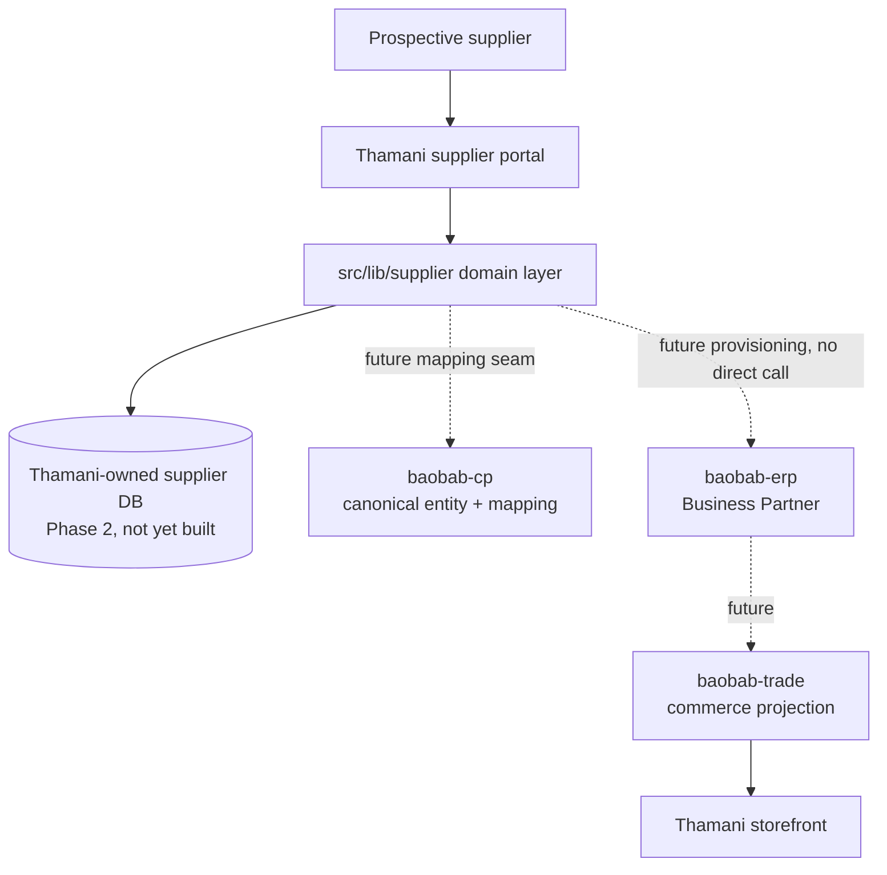

# Supplier onboarding architecture

See ADR-0002 for the accepted decision this document elaborates.

Thamani owns the supplier onboarding _experience_: registration, the
multi-section application, document upload, product proposals, status
tracking, and messages. It does not own canonical identity (`nabhold/baobab-cp`),
operational supplier/procurement master data after approval
(`nabhold/baobab-erp`), or commerce projections of approved products
(`nabhold/baobab-trade`). This mirrors the boundary this repository already
keeps for commerce: Thamani reads from Medusa, it does not become Medusa.

Dotted edges do not exist yet. They are the seams `@nabhold/supplier-domain`
and `contracts/supplier-onboarding/v1` were designed to make mechanical once
the systems on the other end exist:

- `E`: `SupplierOrganisation.canonicalOrganisationId` is reserved and null
  until `nabhold/baobab-cp` has a canonical Organisation type and
  `nabhold/shared`'s ERP system-of-record assigns that concept an owner.
  `nabhold/baobab-cp` ADR-0006 separately registers `SUPPLIER_ORGANISATION`
  as a canonical entity kind Thamani can register into once it is ready.
- `F`: Thamani never calls `baobab-erp` directly (ADR-0001). Provisioning an
  approved application into an ERP Business Partner is a future consumer of
  `contracts/supplier-onboarding/v1`'s events, not a Thamani API call.
- `G`: only a commerce assortment decision downstream of ERP provisioning
  and product qualification creates a Medusa projection — never an
  automatic consequence of application or product approval.

## Why a second, separate domain layer instead of one shared with commerce

`src/lib/medusa` is a read-mostly adapter to an external system of record.
`src/lib/supplier` is a write-heavy domain Thamani is itself authoritative
for pre-approval, following the exact reasoning `nabhold/zuribeans` recorded
in its own ADR-0006: no other system in this ecosystem is authoritative for
"is this organisation an approved supplier and what can it supply" yet, so
the hosting estate must be, for now. The two layers stay separate so a
future ERP-authoritative supplier record does not require restructuring how
Thamani reads commerce data, and vice versa.
