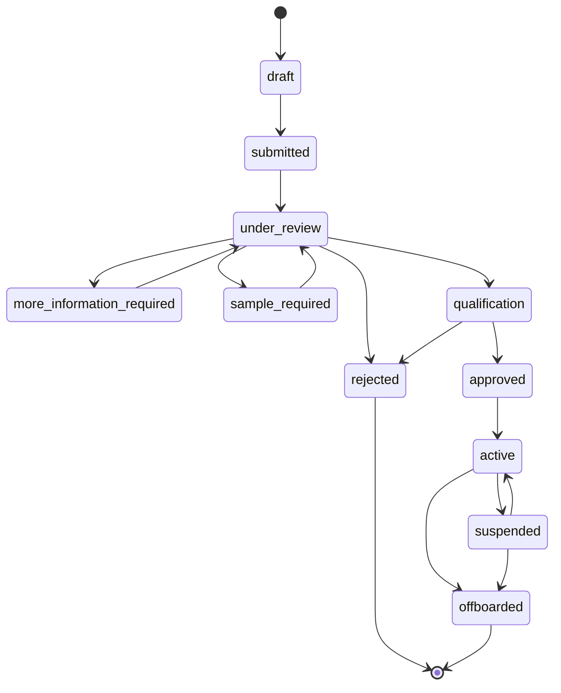

# Supplier onboarding domain model

The shapes below are `@nabhold/supplier-domain`'s (`nabhold/shared`,
`packages/supplier-domain`). Thamani does not redefine them; this document
exists so `src/lib/supplier` can be implemented against a stable reference
before that package has a published release to depend on directly (see
ADR-0002). Once it does, this document should point at the package's own
README rather than restate its contents.

## Lifecycle

`SupplierApplicationStatus` — the proven set from `nabhold/zuribeans`
ADR-0006, reused rather than redesigned:

Transitions are enforced by `@nabhold/supplier-domain`'s `createLifecycle`
mechanism (`supplierApplicationLifecycle.assertTransition`), not by ad hoc
status writes. A disallowed transition throws rather than silently applying.

## Entities

| Entity                  | Owner (pre-approval) | Notes                                                                                                                                                         |
| ----------------------- | -------------------- | ------------------------------------------------------------------------------------------------------------------------------------------------------------- |
| `SupplierOrganisation`  | Thamani              | `canonicalOrganisationId` reserved, always null in this increment. `applicantIdentityRef` is unimplemented until Thamani has an account system.               |
| `SupplierContact`       | Thamani              | Name, email, role, phone; multiple per organisation.                                                                                                          |
| `SupplierCapability`    | Thamani              | `category` is a key into Thamani's own category registry (see below), never a category-specific column. `verificationStatus`: declared / verified / rejected. |
| `SupplierCertification` | Thamani              | Metadata only (type, issuer, reference, dates). Document _files_ are an explicit gap — no object storage decision has been made for Thamani yet.              |
| `SupplierStatusEvent`   | Thamani              | Append-only audit trail: `fromStatus`, `toStatus`, an origin-carrying `actor` (never a bare name), `reason`, `occurredAt`.                                    |

## Category registry

Thamani defines its own `SupplierCategoryRegistry` via
`@nabhold/supplier-domain`'s `defineCategoryRegistry` — categories are
registry entries, never `coffee_*`/`electronics_*`-style columns. Thamani's
registry reflects general retail sourcing (its own product categories), not
`nabhold/zuribeans`' green-coffee-specific one; the two estates' registries
are expected to differ and are not meant to be reconciled.

## Explicitly out of scope for this increment

- Product proposal / `SupplierProductSubmission` and its own lifecycle
  (directive Phase 7) — not modeled yet. `SupplierCapability` records what a
  supplier can supply in general terms; it is not a specific product
  proposal and approving one never implies approving the other.
- `SupplierMarketEligibility` / `SupplierProductMarketEligibility` — no
  destination-market eligibility model exists yet; Thamani currently
  operates as a single estate, so per-market eligibility has no second
  market to distinguish against today.
- Scoring, performance tracking, and the preferred-supplier programme —
  decision-support features that need real qualification history to exist
  against first.
