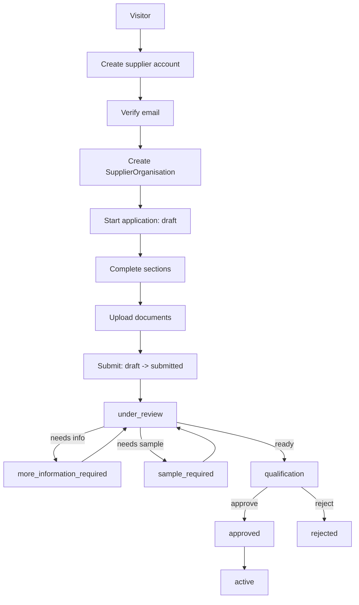

# Registration and application flow (design, not yet built)

This documents the intended Phase 2 flow. No route, server action, or
database table described here exists yet — see ADR-0002 for what this
increment actually delivers (domain shapes and lifecycle only).

## Progressive registration

Initial registration collects only enough to create an account and a
resumable application: contact name, business email, an authentication
credential, company name, country, phone, and a declaration that the user
is authorised to represent the organisation. The full multi-section
application (organisation, contacts, capabilities, certifications) is
completed afterward and must be resumable — a supplier who leaves mid-form
must not lose what they already entered.

## What blocks building this today

- **No account system.** Thamani has no authentication implementation at
  all (see discovery notes in ADR-0002). Registration and email
  verification need one to exist first; this is a real prerequisite, not a
  design choice deferred by convenience.
- **No database.** `SUPPLIER_DB_URL` and its migrations do not exist yet.
  `nabhold/zuribeans` ADR-0006 is the reference for how to introduce one
  (estate-owned, never shared with or copied from any Baobab engine's
  database).
- **No document storage decision.** Certification and compliance document
  _uploads_ need an object-storage decision this increment does not make.

## Internal review

Not implemented. `@nabhold/supplier-domain`'s lifecycle already models
`under_review`, `more_information_required`, `sample_required`, and
`qualification` so a future review surface has real states to transition
through rather than inventing them under time pressure later — the same
reasoning `nabhold/zuribeans` ADR-0006 gives for building its lifecycle
ahead of the UI that exercises it.
